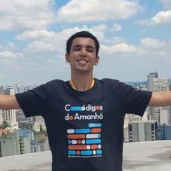
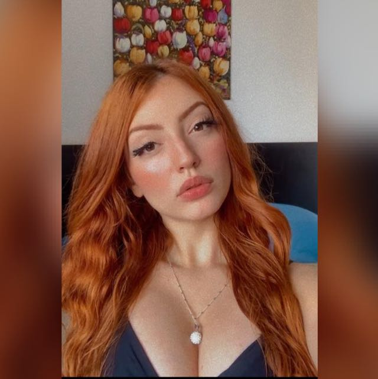
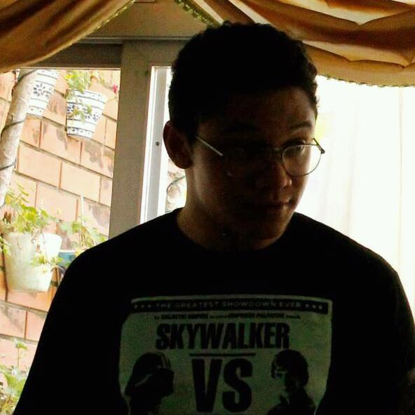

<link rel="preconnect" href="https://fonts.googleapis.com">
<link rel="preconnect" href="https://fonts.gstatic.com" crossorigin>
<link href="https://fonts.googleapis.com/css2?family=Bungee+Shade&family=Cookie&family=Press+Start+2P&family=Righteous&family=Send+Flowers&display=swap" rel="stylesheet">
<link href='./readme.css'>

<h4 align="center"> 
    :construction:  Projeto em construção  :construction:
</h4>
<h1 align="center" style='font-family: Righteous'> Estatísticas: League Of Legends</h1>

<h4 align="center"> 
    
</h4>
## :hammer: Funcionalidades do projeto

- `Consultar Taxas`: Tem como finalidade consultar taxas de: ban, popularidade & bans.
- `Funcionalidade Competitivo`: Tem como funcionalidade consultar dados sobre o competitivo de modo GERAL.
  
  <h4>✔️ Técnicas e tecnologias utilizadas</h4>
- `SQL`
- `EXCEL`
- `VSCODE`
- `CSS`
- `HTML`

## Autores

| [  Alexandre Neckel](https://github.com/XandiNeckel) |  [ Gustavo Arcoverde](https://github.com/GustavoArcoverde) |  [ Jéssica Paiva](https://github.com/Jessica-s-paiva) |
| :---: | :---: | :---:

| [ Verônica Ribas](https://github.com/VeronicaRibas) |  [ Isaque Rodrigues](https://github.com/isaquerodrigues00) | 
| :---: | :---: 
