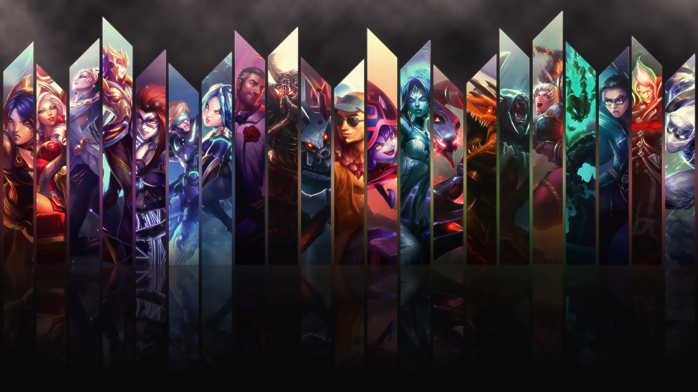

<link rel="preconnect" href="https://fonts.googleapis.com">
<link rel="preconnect" href="https://fonts.gstatic.com" crossorigin>
<link href="https://fonts.googleapis.com/css2?family=Bungee+Shade&family=Cookie&family=Press+Start+2P&family=Righteous&family=Send+Flowers&display=swap" rel="stylesheet">
<link href='./readme.css'>

<h1 style='font-family: Righteous'> Estatística: League Of Legends</h1>

:construction: Projeto em construção :construction:
